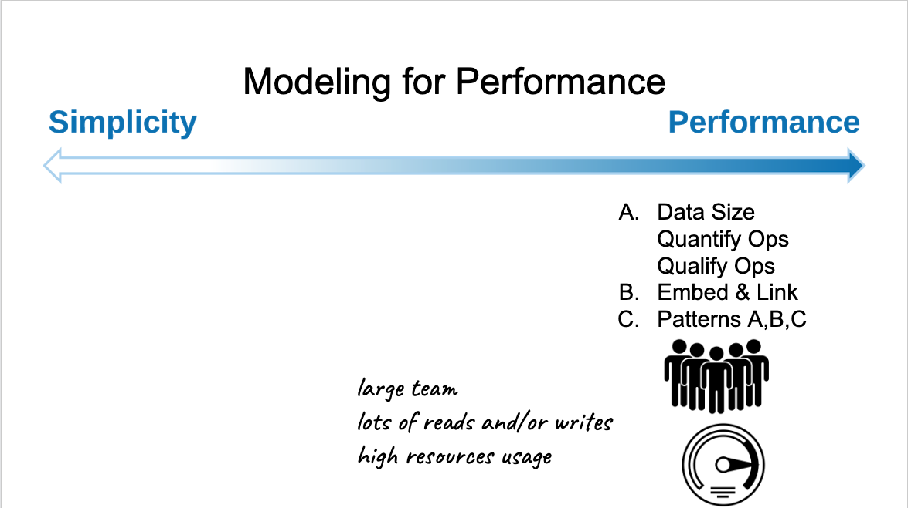
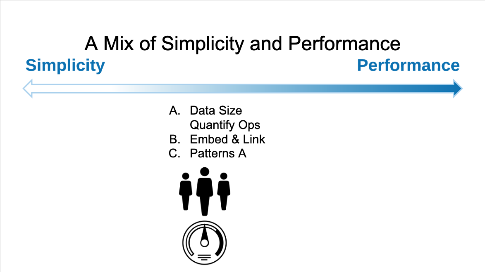

# Notes on MongoDB University course: M320: Data Modeling

<!-- TOC -->autoauto- [Notes on MongoDB University course: M320: Data Modeling](#notes-on-mongodb-university-course-m320-data-modeling)auto    - [Resources](#resources)auto    - [Introduction](#introduction)auto    - [MongoDB Document model](#mongodb-document-model)auto    - [Methodology](#methodology)auto    - [Simplicity versus Performance](#simplicity-versus-performance)auto    - [Identifying the workload](#identifying-the-workload)auto- [Relationships](#relationships)auto    - [Many-to-many](#many-to-many)auto    - [One-to-one](#one-to-one)auto    - [Concerns](#concerns)auto        - [Duplication](#duplication)auto        - [Staleness](#staleness)auto        - [Referential Integrity](#referential-integrity)auto        - [To recap](#to-recap)auto- [Patterns](#patterns)auto    - [The attribute pattern](#the-attribute-pattern)auto    - [Extended reference pattern](#extended-reference-pattern)auto    - [Subset pattern](#subset-pattern)autoauto<!-- /TOC -->

## Resources

Reference material

- [MongoDB University course](https://university.mongodb.com/mercury/M320/2019_ondemand/overview)
- [Advanced Schema Design Patterns](https://www.mongodb.com/presentations/advanced-schema-design-patterns)
- [Building with patterns](https://www.mongodb.com/blog/post/building-with-patterns-a-summary)
- 6 rules of thumb for MongoDB schema design ([part 1](https://www.mongodb.com/blog/post/6-rules-of-thumb-for-mongodb-schema-design-part-1), [part 2](https://www.mongodb.com/blog/post/6-rules-of-thumb-for-mongodb-schema-design-part-2), [part 3](https://www.mongodb.com/blog/post/6-rules-of-thumb-for-mongodb-schema-design-part-3))
- Time series and IoT ([part 1](https://www.mongodb.com/blog/post/time-series-data-and-mongodb-part-1-introduction), [part 2](https://www.mongodb.com/blog/post/time-series-data-and-mongodb-part-2-schema-design-best-practices), [part 3](https://www.mongodb.com/blog/post/time-series-data-and-mongodb-part-3--querying-analyzing-and-presenting-timeseries-data))
- Document versioning patterns
  - [Track versions](http://www.askasya.com/post/trackversions/)
  - [Merge shapes](http://www.askasya.com/post/mergeshapes/)
  - [Best version](http://www.askasya.com/post/bestversion/)
  - [Revisit versions](http://www.askasya.com/post/revisitversions/)

Extra

- [On selecting a shard key for MongoDB](https://www.mongodb.com/blog/post/on-selecting-a-shard-key-for-mongodb)
- [Select for update with MongoDB Transactions](https://www.mongodb.com/blog/post/how-to-select--for-update-inside-mongodb-transactions)

Epilogue

Sharding

    Sharding is an extremely important topic for large-scale systems that will impact your design decisions. Most systems do not reach sizes that require Sharding. However if your system is already sharded or you are sure that your system will need to be, you should get familiar with the main concepts of Sharding. Here are some important reads on Sharding:

        Documentation on Sharding https://docs.mongodb.com/manual/sharding/
        Choosing a Shard Key https://docs.mongodb.com/manual/core/sharding-shard-key/#choosing-a-shard-key/

Query Effectiveness

    We taught you to think early about your queries and to model based on your system's workload.

    Once you've implemented your schema design, how do you assess the effectiveness of your queries? Consult the following resources to validate that your queries are working as expected, using the right indexes, and are not running too slowly:

        Indexing Strategy https://docs.mongodb.com/manual/applications/indexes/
        Analyze Query Performance https://docs.mongodb.com/manual/tutorial/analyze-query-plan/

Document and Schema Validation

    We mentioned that although MongoDB uses a flexible schema, you can still enforce constraints on your data models. You can add many different kinds of validation, such as field type, value, and presence.

    To know more about Schema Validation, please refer to the following resources:

        Documentation on the Schema Validation topic. https://docs.mongodb.com/manual/core/schema-validation/

Transactions in MongoDB

    We mentionned a few times that MongoDB now supports transactions. To know more about them, please refer to the following resources:

        Documentation on Transactions https://docs.mongodb.com/manual/core/transactions/
        Videos explaining their implementation https://www.mongodb.com/transactions

Schema Design Patterns

    To see additional information on our Schema Design Patterns, please refer to the following resources:

        Series of blogs on Schema Design Patterns https://www.mongodb.com/blog/post/building-with-patterns-a-summary
        Video from MongoDB World on Schema Design Patterns https://www.mongodb.com/presentations/advanced-schema-design-pattern

## Introduction

MongoDB unquestionably has a very flexible data model. There are no default rules on what documents should be looking like apart from having correctly been defined in BSON and containing a primary key. Being flexible means that your application changes. You will be able to accommodate those changes without experiencing a painful migration process, like in traditional relational databases. MongoDB will help you iterate on the schema designs of your models throughout your application's lifecycle. The document model is great for data definition, and MongoDB's flexible schema makes it easier for you to apply changes and iterate over your application. All data sources have a base schema. MongoDB just makes it easier to adapt our models to variations on that schema. Both unstructured and structured data sets can be easily handled by MongoDB.

You will be able to extract a very good model, even before rewriting the full application to make it scale with MongoDB when you experience

- how your data is accessed
- know your usage pattern
- which queries are critical to your application
- ratios between reads and writes

## MongoDB Document model

Data in MongoDB stored in a hierarchical structure where the database are at the top level where each MongoDB deployment can have many databases. Then there are one or more collections in the database. And finally, there are documents which are kept at the collection level.

In MongoDB, data is stored as BSON documents that are composed of field value pairs, where BSON is a binary representation of JSON documents. Each value can be of any BSON data type, which in this case are a string, an integer, another string, and an array.

Benefits:

- Instead of having to query multiple tables of related data and assembling it all together, you can keep your related data in a single document and pull it all down using a single query.
- Since MongoDB documents support a flexible structure, you can use a document to represent an entire object rather than having to break up the data across multiple records as you would have to do with the relational database.

The exact structure of a document-- all the fields, values, and embedded documents-- represent the schema of a document. MongoDB documents have a flexible schema in that you're not required to make complicated changes to a collection's metadata to add or remove the fields in a documents. Documents in the same collection don't need to have the exact same list of fields. Furthermore, the data type in any given field can vary across documents.

Another way to view this is that you can have multiple versions of your schema as your application develops over time and all the schema versions can coexist in the same collection. That said, chances are that the documents in a given collection will have a common structure between them.

MongoDB supports enforcing the schema shape from no rules, rules in a few fields, to rules on all the fields of the documents.

## Methodology

There are three phases in our methodology.

1. workload
   1. size of your data
   2. the important reads and writes of the system, and possibly quantify and qualify those operations.
1. identification of the relationships
1. apply schema design patterns to your model to address the performance requirements by applying the needed optimizations

## Simplicity versus Performance

My advice is it is easier to find optimization later on than to remove complexity from an application. So prior to rise simplicity over performance.

## Identifying the workload

Steps to consider:

- Listing the write operations.
- Listing the read operations.
- Quantifying each of the operations in terms of latency and frequency.
- Identifying the durability of each write operation.

# Relationships

MongoDB is classified as a document database, the pieces of information stored in the database still have relationships between them.

Old style databases are often referred to as relational databases. However, NoSQL databases are also relational, so a better name for those legacy databases is Tabular, which highlights a notion of columns and tables.

Understanding how to represent relationships, and deciding between embedding and linking relationship information, is crucial. The face of identifying and modeling relationships correctly is a step that is not optional in the methodology.

Having a good model is the single most important thing you can do to ensure you get good performance.

If you know that you are traversing a huge relationship, you may want to represent it differently or be more careful about how you write queries when handling the zillions side of this side of the relationship. Large numbers were rarely a consideration in the past, however, they became a serious consideration when dealing with big data. Because there is no graphical notation in the crow's foot notation for this kind of a relationship, we added one to highlight the fact that huge cardinalities may impact design choices.

## Many-to-many

ask the right questions to ensure it is a many-to-many relationship that should not be simplified.

A many-to-many relationship can be replaced by two one-to-many relationship, but does not have to with the document model.

Prefer embedding on the most queried side, prefer embedding for information that is primarily static over time and may profit from duplication, prefer referencing over embedding to avoid managing duplication.

## One-to-one

Prefer embedding over referencing for simplicity.
Use subdocuments to organize the fields.
Use a reference for optimization purposes.

## Concerns

### Duplication

Why do we have duplication? It is usually the result of embedding information in a given document for faster access.

What's the concern? The concern is that it makes handling changes to duplicated information a challenge for correctness and consistency, where multiple documents across different collections may need to be updated.

There is this general misconception that duplication should not exist. In some cases, duplication is better than no duplication.

Let's start with a situation where duplicating information is better than not doing it.

- orders of products to the address of the customer that placed the order by using a reference to a customer document.
- updating the address for this customer updates information for the already fulfilled shipments, order that have been already delivered to the customer.

This is not the desired behavior. The shipments were made to the customer's address at that point in time, either when the order was made or before the customer changed their address. So the address reference in a given order is unlikely to be changed. Using a new address for new orders, does not affect the already shipped orders.

The next duplication situation to consider is when the copy data does not ever change.

- Let's say we want to model movies and actors.
- Movies have many actors and actors play in many movies.
- Avoiding duplication in a many-to-many relationship requires us to keep two collections and create references between the documents in the two collections.

If we list the actors in a given movie document, we are creating duplication. However, once the movie is released, the list of actors does not change. So duplication on this unchanging information is also perfectly acceptable.

The last duplication situation, the duplication of a piece of information that needs to or may change with time.

- revenues for a given movie, which is stored within the movie, and the revenues earned per screening.
- duplication between the sum store in the movie document and the revenue store in the screening documents used to compute the total sum.

This type of situation, where we must keep multiple values in sync over time, makes us ask the question is the benefit of having this sum precomputed surpassing the cost and trouble of keeping it in sync?

If yes, then use this computed pattern. If not, don't use it.

Here, if we want the sum to be synchronized, it may be the responsibility of the application to keep it in sync. Meaning, whenever the application writes a new document to the collection or updates the value of an existing document, it must update the sum.

### Staleness

Staleness is about facing a piece of data to a user that may have been out of date.

New events come along at such a fast rate that updating data constantly can cause performance issues.

The main concern when solving this issue is data quality and reliability. We want to be able to trust the data that is stored in the database.

The right question is, for how long can the user tolerate not seeing the most up-to-date value for a specific field.

For example, the user's threshold for seeing if something is still available to buy is lower than knowing how many people view or purchase a given item.

When performing analytic the queries it is often understood that the data may be stale and that the data being analyzed is based on some past snapshot.

Analytic queries are often run on the secondary node, which often may have stale data. It may be a fraction of a second or a few seconds out of date.

### Referential Integrity

Our third concern, when using patterns, is referential integrity.

Why do we get referential integrity issues?

Frequently, it may be the result of deleting a piece of information - for example, without deleting the references to it.

In the big data world, we can also associate referential integrity issues to adding distributed system, where a related piece of information live on different machines.

At this time, the MongoDB server does not support foreign keys and associated cascading deletes and updates responsible for keeping referential integrity. It is the responsibility of the application to do so.

Here again, the main concern is data quality and reliability.

- For delayed referential integrity, we can, again, rely on change streams.
- For keeping the referential integrity, we can avoid using references by embedding information in a single document, instead of linking it.
- Or we can use MongoDB with be multi-document transactions to update multiple documents at once

### To recap

We can tame these three concerns-- duplication, staleness, and referential integrity-- by understanding the following for every piece of data in your database:

- Should or could the information be duplicated or not?
  - If it has to be duplicated and consistently updated, resolve the duplication with bulk updates.
- What is the tolerated or acceptable staleness?
  - Resolve with updates based on change streams.
- Which pieces of data require referential integrity?
  - Resolve or prevent inconsistencies with change streams or transactions.

# Patterns

## The attribute pattern

The attribute pattern. Polymorphic, one of the most frequent schema design patterns used in MongoDB. Polymorphic is when you put different products, like these three examples, in one collection without going through relational acrobatics.

For this case you want to use the attribute pattern. It helps to organize fields that have either common characteristics you want to search across, or fields that are rare, or when you need to manage an influx of unpredictable properties.

It potentially reduces the number of indexes.

To use the attribute pattern you

- start by identifying the list of fields you want to transpose.
- Here we transpose the fields input, output, and capacity.
- Then for each field in associated value, we create that pair.
- The name of the keys for those pairs do not matter. Only for consistency, let's use K for key and V for value, as some of our aggregation functions do.

Benefits

- The main benefit of using the attribute pattern is that it becomes more straightforward to index all of these fields.
- It allows for non deterministic field names meaning we don't need to know all the possible field names in advance. We can get new ones on the fly and still use an index to optimize the queries.
- another advantage is the ability to qualify a relationship between a key and a value by adding a third member in our documents, representing the transformation (e.g. mAh, cl, meter)

## Extended reference pattern

There are a few ways you can do joins in MongoDB.

- Before the MongoDB servers supported any joining facilities, the only possible way was to do the joins in the application side.
- Now the aggregation framework supports joins through the \$lookup operation.
- There is also a \$graphLookup operator to perform recursive queries over the same collection, a recursive self-join, similar to the ones you find in graphed other bases.

There is one more method, and it is to avoid doing a physical join.

- You can embed a one-to-many relationship on the one side.

Basically, instead of adding a simple reference from the document in the invoice collection to this one in the customer collection, we built an extended reference, meaning the reference is rich enough, that we will not need to perform the join most of the time.

Every time we talk about duplicating data, it is worth understanding the consequence.

- The first thing to understand is how to minimize duplication. The extended reference pattern will work best if you select fields that do not change often.
- Also, only bring the fields you need. When we look up an invoice, we may want to see the list of products with their supplier name but there is little reason to show the phone number of the supplier at this point.

Then, when the source field is updated, identify what should be change, meaning the list of extended references, and the when should they be changed.

- For example, it may be necessary to update them right away.
- However, sometimes it is OK to leave the data alone and update it later in a batch, when you have available resources. For example, changing the ranking of my best-selling products does not require me to instantly update all the products that spell out the rank of the product on their page.

Interesting enough, the example we use with invoices and addresses is a case where duplication is not a problem, but rather the right solution.

- When the invoice was created, the customer may have lived in one location, and they have moved since.
- If we were to keep the last address of the customer in a reference in the invoice, we will be pointing to the new address, not where the products of this invoice were shipped.
- In this case, we want the invoice to keep pointing to the old address. The characteristic of the invoice that make it work well are the fact that the invoice is created at a given time in the timeline, and the invoice remains static over time.

Benefits

- The problem the extended reference pattern addresses is avoiding joining too many pieces of data at query time.
- If the query is frequent enough and generates a considerable amount of lookups, pre-joining the data can be done by applying this pattern.
- The solution is to identify the fields you are interested in on the looked up side and make a copy of those fields in the main object.
- The common thread here is to reduce the latency of your read operations or avoid round trips or avoid touching too many pieces of data.
- You will get faster reads, due to the reduced of joints and lookups.

You will see this pattern often used in catalogs, mobile applications, and real-time analytics. The price you will pay for the improvement in performance is the fact that you may have to manage a fair amount of duplication, especially if you embed Many-to-One relationships, where the fields change or mutate a lot.

## Subset pattern

MongoDB tries to optimize the use of RAM by pulling in memory only the document that it needs from the disk through the RAM. When there is no more memory available, it evicts pages that contains the document it doesn't need anymore to make room for more document it needs to process at the moment. The working set refers to the amount of space taken by the documents and the portions of indexes that are frequently accessed. As long as the size of your working set fits in RAM, you get good performance.

The process, of constantly ejecting documents that should stay in memory, is bad-- pretty, pretty bad. The fix can be either one of the following three solution.

- add more RAM-- In other terms, scale your infrastructure vertically.
- start sharding, or add more shards if you already have a sharded cluster. Sharding has a similar effect as A, since you provide more RAM to the cluster overall, through adding machines to it.
- reduce the size of the working set.

For the purpose of this lesson, we are going to consider reducing the size of the working set. The key to that is breaking up huge documents, which we only need a fraction of it.

the subset pattern is a great pattern to help you reduce the size of your working set by splitting information that you want to keep in memory, versus information that you fetch on demand.

Let's organize what we've been describing and illustrating a little bit.

- The problem to the subset pattern addresses is that too many frequently use pieces of information-- or I checked it from memory, which can be identified by observing a working set that this too big to fit in memory.
- Digging into the majority of documents in memory, we can observe that we only make use of a small subset of information in those documents.
- So a large part of those documents is rarely needed.

Our solution is to break apart the documents that are taking too much space in RAM.

- We will divide the fields of information into two camps-- the field that are often required by our system, and the ones that are rarely required.
- This division is frequently used for one-to-many or many-to-many relationship, for which you only want to keep a subset of the many associated document.

Benefits

- As a result of applying the subset pattern, our working set will not only be smaller, but it will make retrieving additional documents faster since they will be smaller.

List of anything that can be long and carries much more data than anyone can or wants to process or read. If this list takes a substantial amount of memory, they are good candidates to be offload to another collection.

First, you have more documents to retrieve, which means that you may have to make more round trips between the application and the server.
And second, the fact that you break documents in two and duplicate some info means that the database will require a little bit more space on disk.

## Computed

Some computations are very expensive to do.

If you store your information as base units in your database, you may find yourself redoing the same computations, manipulations, or transformations over and over.

They usually fall into one of those three categories-- mathematical operations, fan out operations, and roll-up operations.

We will group those under a new pattern, which we will call the computed pattern.

- mathematical operations are easy to identify.
  - These are the ones where we compute a sum or an average, find a median, et cetera.
  - Once we have a new piece of data, we read the other element for the sum and store the result in another collection with documents more appropriate to keep the sum for that element.
  - This results in much fewer computation in the system, and we also reduce the amount of data being read.
- Fan out operations.
  - fan out is to do many tasks to represent one logical task.
  - fan out on reads, which means in order to return the appropriate data, the query must fetch data from different locations
  - fan out on writes, which means every logical write operation translate into several writes to different documents.
    - In doing so, the read does not have to fan out anymore, as the data is pre-organized at write time.
    - If the system has plenty of time when the information arrives compared to the acceptable latency of returning data on read operation, then preparing the data at write time makes a lot of sense.
    - Note that if you are doing more writes then reads so the system becomes bound by writes, this may not be a good pattern to apply.
- Roll-up operations.
  - We use this terminology in a position to drill-down operation. In the roll-up operation, we merge data together.
  - Any operation that wants to see data at a high level is basically looking at rolling up data.
  - If I'm looking more often at the information on the right, the non-aggregated data than the changes that are happening on my collection on the left, it makes more sense to generate this data and cache it in the appropriate documents.

When should you apply the computed pattern?

- If you see you are using a lot of CPU, this may be a sign that you're doing much more than transferring data from and to the disk.
- Secondly, if you have long read operation that depends on complex aggregation queries, you might want to make them run faster.

The problem the computer pattern addresses is avoiding doing the same computation over and over, especially if they're expensive.

The solution is to perform the computation and store the result in the appropriate document and collection.

If you need to redo the computation or want to be able to redo them, just keep the source of your computations, meaning keep the smaller documents or piece of information.

Common use cases where you may want to use the pattern are the Internet of Things, event sourcing, time series data, and any scenario where you do repeated similar aggregation queries.

The benefits you get from the computed pattern are faster read and less utilization of resources, mostly CPU and disk.

However, it may be difficult to diagnose that you may benefit from such patterns on a large existing cluster.

It is easy to abuse the computed pattern.

Use it when you need it, as the required computation may add complexity to the application code.

## Bucket pattern

Let's say we have 10 million temperature sensors, and each sensor is sending us a piece of data every minute, the temperature it's measuring. This is 36 billion pieces of information per hour. Trying to store each piece in a document may not work as we get too many documents to manage.

On the other end, if we keep one document per device, each document is likely to reach the maximum size of 16 megabytes after a while. Even if it does not reach that size, it may still be unmanageable and not very efficient to handle these large documents.

One suggestion is to have one document per device, per day. Each document would only carry information for a single device on a single day. Then the next day, we will create a new document.

Another option is to have one document per device, per hour. Here, our time stamps includes the date and the hour. We have one document for 1:00 PM and one document for 2:00 PM. There are more documents, 24 times more than this example. However, the documents are smaller.

This concept of grouping information together is called bucketing. And as you guessed, the bucket pattern is often used in the IoT scenarios.The bucket pattern is a great pattern if you want a middle ground solution between fully embedding and fully linking data.

Let's look at some restriction or gotchas when using the bucket pattern.

- The problems the bucket pattern address are helping us size our documents to satisfy the combination of read and write operations of our workload.
- This helps embed a one-to-many relationship, where the many side is too big or grows beyond bounds.
- The solution is to find the optimal amount of info, then store it in arrays or arrays of arrays in our main objects.
- The one-to-many relationship is transformed so the one side becomes N documents.

On the trade-offs

- ensure you know all you want to query the data.
- If you need to frequently access elements in the buckets to do updates, deletions, or want to insert in specific locations, this may not be the best pattern to use.
- If you need to get the data sorted in any way, it is preferable to have it sorted in the buckets themselves.
- Ad hoc queries may be difficult to do, as you need to understand the underlying structure.
- If every query translate to an aggregation query, that will first scan the data, the schema you choose may not be the right one.
- Also, it may not be friendly to all BI Tools, as your users need to understand the schema to do the queries.

## Schema Versioning

Nearly all applications in their lifetime will require updates to their database schema. The schema versioning pattern is based on the flexible aspect of documents in MongoDB. Because documents can have different shapes, we construct our applications to deal with those variants.

The schema versioning pattern is a great pattern if you want to avoid downtime while performing schema upgrade and want to stay in control of those upgrades. If you have a small system with the ability to bring it down for an acceptable period of time, you may just want to do that and do your updates the old fashioned way.

- Updating all documents can take a long time-- hours, day, or even weeks when dealing with big data.
- And there is the situation where you have so many legacy documents, or any other reason for which you don't want to update everything.

As illustrated in our previous screens, the solution is to use a field present in each document to keep the version number.

- Schema version is suggested, but not mandatory.
- Secondly, the application should be able to handle the different shapes of the documents.
- layout the strategy to migrate your documents. You are in charge.

On the benefits side, they are pretty evident.

- You can avoid downtime.
- You feel in control of the migration the whole time, done when you want to do it.

On the trade-off side,

- if you have an index in the field that's not located at the same level in the document, you may need to index while you're doing the migration.
- And finally, unlike the fiscal debt, the technical debt, and environmental debt we are usually leaving to the next generation, at least here we can build system that should be easier to maintain and migrate by your future colleagues.

## Tree patterns

Documents are very good data structures to represent nodes in a tree.

The fact that documents can hold parts or branches of the tree within themselves allows us to represent in a very efficient way models that do not rely on suboptimal drawings to retrieve the hierarchical information we require for each node.

There are several different ways to represent nodes of a tree using documents, and you can even use a combination of different patterns in your model.

The choice of which patterns you use should be based on which are the most common operations that your application will be performing and optimized for those choosing the best pattern that allows you to do the most efficient queries on that particular application.

- We want to be able to do a couple specific operations very quickly and without lots of unnecessary logic.
- These operations include navigating to the immediate parent node and finding all categories of products that descend from a given node.
- Tree parents are used to model hierarchical data structures.
- There is a good variety of tree patterns that we can apply as a solution for those same hierarchical data structures modeling.
- These are generally used in org charts, product categories, and others.
- The different patterns offer different benefits.
  - Child references are ideal to navigate the descending the hierarchical of nodes of our tree, where on each node, we can find the immediate child references.
  - Parent reference is ideal to navigate upwards in the tree in institutions where the tree is constantly being updated or moved.
  - Array of ancestors is ideal to get a full view of a branch of the tree structure up to the node itself, where materialized path is an alternative to use a single field index on a string value that enables the user to regular expressions to find documents in a branch of the tree.
  - Tree patterns are an effective way of representing these use cases.

## Polymorphic pattern

The problem that the polymorphic pattern addresses is allowing us to keep documents that have more common things in the same collection.
The solution is to have a field that keep tracks of the shape of the document or sub-document.

Then have the application use different code paths to handle the differences in the documents using that field value.

If the differences are substantial, we often have subclasses allowing the different concerns in the base class to handle the similarities.

The most common use cases for this pattern are single view implementations, product catalogs, and content management applications.

## Approximation

The approximation pattern is used to reduce the number of resources needed to perform some write operations. The approximation pattern is used whenever there is a significant tolerance to data imprecision, or when an operation is expensive to compute with very little value added by precision.

Its implementation is to do fewer writes, but with a higher payload.

The typical benefits of this pattern are a reduction in the number of writes, less write contention while updating the same documents, statistically valid numbers, even if not exact per unit of time.

The implementation of this pattern must reside in the client side application. This pattern is not specific to MongoDB.

## Outlier pattern

An outlier is something that stands out from the rest of the crowd. For example, a famous singer may have 100 million followers on the social media app, while the majority of users have less than 1,000 followers. The danger with outliers is that they could drive developers to implement a solution that is suboptimal for 99.99% percent of use cases just to accommodate the outlier.

Do not be afraid of implementing a design that works well for the vast majority of use cases and then identifies these outliers as exceptions. The application can then be instructed to handle just these outliers differently.

The main benefit of this pattern is that the application remains optimized for most use cases. The drawback is that

- the application must handle the outliers separately.
- it makes it harder to write queries that can process the whole data set in the one uniform operation.

## Overview

